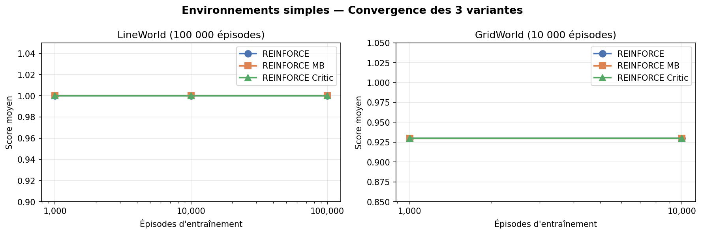
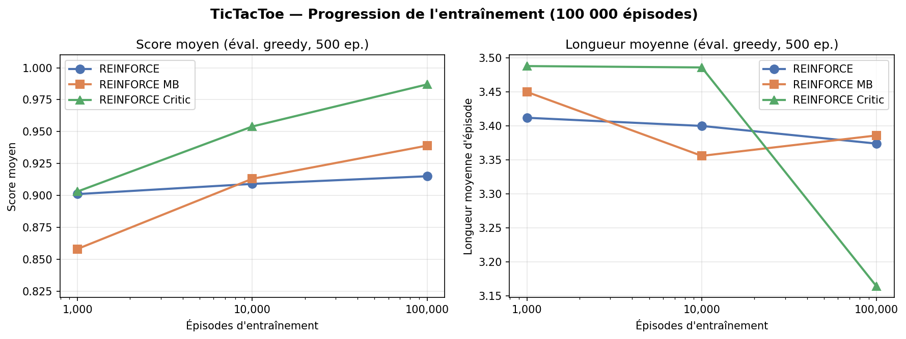
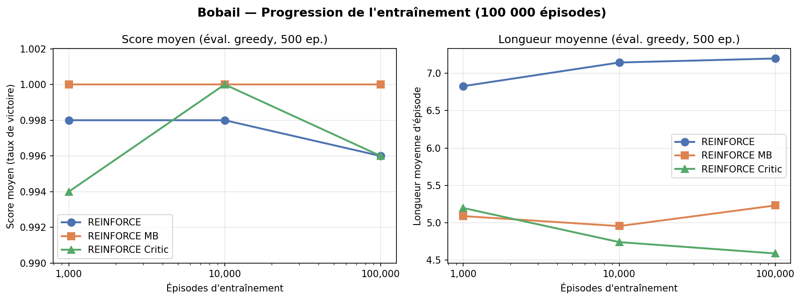
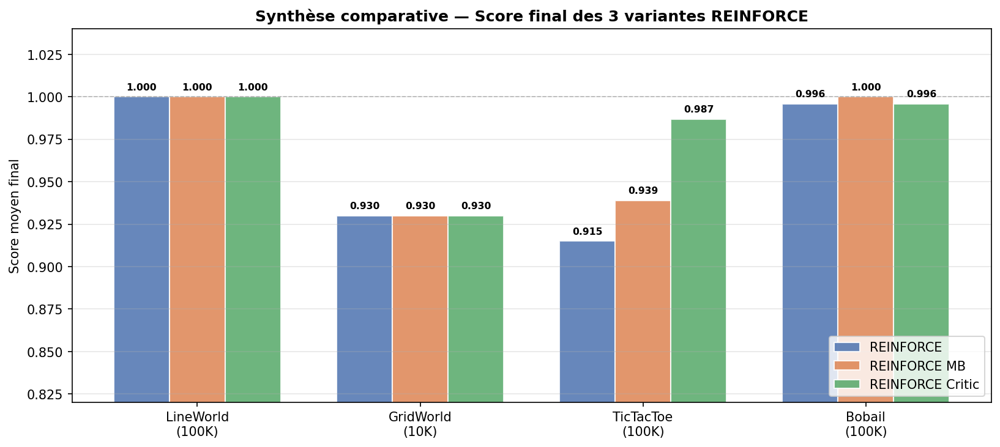

# REINFORCE et ses variantes

## Description

### REINFORCE (Gradient de politique Monte-Carlo)

REINFORCE (Williams, 1992) est l'algorithme fondateur des méthodes de gradient de politique (*policy gradient*). Contrairement aux méthodes basées sur la valeur (Q-learning, DQN…), REINFORCE optimise directement la politique $\pi_\theta(a|s)$ paramétrée par un réseau de neurones, sans passer par une fonction de valeur intermédiaire.

L'idée centrale repose sur le théorème du gradient de politique (*policy gradient theorem*) :

$$\nabla_\theta J(\theta) = \mathbb{E}_{\tau \sim \pi_\theta}\left[\sum_{t=0}^{T} \nabla_\theta \log \pi_\theta(a_t|s_t) \cdot G_t\right]$$

où $G_t = \sum_{k=t}^{T} \gamma^{k-t} r_k$ est le **retour cumulé actualisé** à partir du pas $t$, et $\gamma \in [0,1]$ est le facteur d'actualisation.

L'algorithme procède en épisodes complets (Monte-Carlo) :
1. Jouer un épisode entier en suivant $\pi_\theta$ et enregistrer $(s_t, a_t, r_t)_{t=0}^T$
2. Calculer les retours $G_t$ pour chaque pas de temps
3. Mettre à jour les paramètres par descente de gradient stochastique :

$$\theta \leftarrow \theta + \alpha \sum_{t=0}^{T} \nabla_\theta \log \pi_\theta(a_t|s_t) \cdot G_t$$

En pratique, la fonction de perte minimisée est :

$$\mathcal{L}(\theta) = -\sum_{t=0}^{T} \log \pi_\theta(a_t|s_t) \cdot G_t$$

La politique est représentée par un réseau de neurones entièrement connecté (*PolicyNetwork*) qui prend l'état $s$ en entrée et produit une distribution de probabilité sur les actions via un softmax. Un **masquage des actions illégales** est appliqué (valeur $-\infty$ avant softmax) pour garantir que l'agent ne choisit jamais une action invalide.

**Avantage** : simplicité, convergence vers un optimum local garantie sous conditions de régularité.  
**Inconvénient principal** : forte variance des gradients, ralentissant la convergence.

---

### REINFORCE avec Baseline Moyenne (Mean Baseline)

Pour réduire la variance des mises à jour sans introduire de biais, on soustrait une **baseline** $b$ au retour :

$$\mathcal{L}(\theta) = -\sum_{t=0}^{T} \log \pi_\theta(a_t|s_t) \cdot (G_t - b)$$

La baseline choisie ici est la **moyenne des retours de l'épisode** :

$$b = \frac{1}{T+1} \sum_{t=0}^{T} G_t$$

Cette baseline est constante pour un épisode donné, ce qui préserve l'absence de biais (le gradient reste en espérance identique), tout en centrant les avantages autour de zéro. Les actions dont le retour est supérieur à la moyenne de l'épisode sont renforcées, les autres sont affaiblies. La mise à jour devient ainsi plus stable et la convergence plus rapide.

---

### REINFORCE avec Réseau Critique (Actor-Critic)

La variante avec réseau critique pousse plus loin la réduction de variance en remplaçant la baseline constante par une **estimation apprise** de la fonction de valeur d'état $V^\pi(s)$.

Un second réseau (*ValueNetwork*) avec la même architecture est entraîné en parallèle pour prédire $V(s_t; w)$. L'avantage estimé est :

$$A_t = G_t - V(s_t; w)$$

La perte totale combine la perte de l'acteur et la perte du critique :

$$\mathcal{L} = \underbrace{-\sum_t \log \pi_\theta(a_t|s_t) \cdot A_t}_{\text{perte acteur}} + \; \alpha_v \underbrace{\sum_t \left(G_t - V(s_t; w)\right)^2}_{\text{perte critique (MSE)}}$$

où $\alpha_v$ est le coefficient de pondération de la perte du critique (`value_coef`). Un seul optimiseur Adam est utilisé pour les deux réseaux simultanément. Le gradient de la perte acteur est **stoppé** sur les valeurs du critique (`.detach()`) afin d'éviter que les gradients de l'acteur ne perturbent l'apprentissage du critique.

Plus le critique converge, plus les avantages $A_t$ sont précis, et plus la variance des mises à jour de l'acteur est faible — ce qui en théorie accélère la convergence vers une meilleure politique.

---

## Architecture du réseau de neurones

Les trois variantes partagent la même architecture de base pour la *PolicyNetwork* :

| Couche | Détail |
|--------|--------|
| Entrée | $\dim(s)$ neurones (taille de l'espace d'état) |
| Couche cachée 1 | 128 neurones, activation ReLU |
| Couche cachée 2 | 128 neurones, activation ReLU |
| Sortie | $\|\mathcal{A}\|$ neurones (logits), masquage des actions illégales |

La *ValueNetwork* (REINFORCE Critic uniquement) a la même architecture, sauf que la couche de sortie produit un **scalaire** (sans activation).

---

## Hyperparamètres

| Hyperparamètre | Valeur | Description |
|----------------|--------|-------------|
| `gamma` | 0.99 | Facteur d'actualisation |
| `lr` | 0.001 | Taux d'apprentissage (Adam) |
| `hidden_sizes` | [128, 128] | Taille des couches cachées |
| `value_coef` | 0.5 | Pondération de la perte critique (Critic uniquement) |
| `max_norm` | 1.0 | Seuil de gradient clipping |
| Optimiseur | Adam | Pour acteur et critique |
| Initialisation seed | 42 | Reproductibilité |

Budget d'entraînement :

| Environnement | Épisodes | max_steps/épisode |
|---------------|----------|-------------------|
| LineWorld | 100 000 | 50 |
| GridWorld | 10 000 | 100 |
| TicTacToe | 100 000 | 50 |
| Bobail | 100 000 | 200 |

---

## Résultats

Les métriques sont calculées lors d'évaluations périodiques (tous les 500 épisodes, sur 500 épisodes de test en mode greedy). Les valeurs présentées correspondent aux checkpoints 1 000, 10 000 et 100 000 épisodes d'entraînement (ou 10 000 pour GridWorld dont le budget est limité à 10 000 épisodes).

### LineWorld

LineWorld est un environnement déterministe unidimensionnel de faible complexité. L'agent doit atteindre l'extrémité droite en partant du centre en exactement 2 pas optimaux.

| Agent | Épisodes | Score moyen | Longueur moyenne |
|-------|----------|-------------|-----------------|
| REINFORCE | 1 000 | **1.000** | 2.0 |
| REINFORCE | 10 000 | **1.000** | 2.0 |
| REINFORCE | 100 000 | **1.000** | 2.0 |
| REINFORCE MB | 1 000 | **1.000** | 2.0 |
| REINFORCE MB | 10 000 | **1.000** | 2.0 |
| REINFORCE MB | 100 000 | **1.000** | 2.0 |
| REINFORCE Critic | 1 000 | **1.000** | 2.0 |
| REINFORCE Critic | 10 000 | **1.000** | 2.0 |
| REINFORCE Critic | 100 000 | **1.000** | 2.0 |

Les trois variantes atteignent un score parfait de **1.000** dès les 1 000 premiers épisodes et maintiennent cette performance jusqu'à la fin de l'entraînement. La longueur moyenne de 2.0 correspond au chemin optimal, ce qui montre que les agents ont non seulement appris à gagner systématiquement mais aussi à le faire de manière optimale.

Ce résultat s'explique par la faible dimensionnalité de l'environnement (espace d'état très restreint) : même REINFORCE sans baseline, malgré sa plus haute variance théorique, converge rapidement vers la politique optimale. LineWorld ne permet pas de distinguer les trois variantes entre elles.

---

### GridWorld

GridWorld est un environnement en grille 2D avec obstacles. L'agent doit trouver un chemin de la case de départ vers la case objectif en évitant les murs. La longueur optimale est de 8 pas.

| Agent | Épisodes | Score moyen | Longueur moyenne |
|-------|----------|-------------|-----------------|
| REINFORCE | 1 000 | **0.930** | 8.0 |
| REINFORCE | 10 000 | **0.930** | 8.0 |
| REINFORCE MB | 1 000 | **0.930** | 8.0 |
| REINFORCE MB | 10 000 | **0.930** | 8.0 |
| REINFORCE Critic | 1 000 | **0.930** | 8.0 |
| REINFORCE Critic | 10 000 | **0.930** | 8.0 |

Les trois variantes convergent vers un score de **0.930** dès les 1 000 premiers épisodes, avec une longueur moyenne stable à 8.0 (chemin optimal). Le score de 0.930 est cohérent avec la structure de récompense de GridWorld : l'agent reçoit une pénalité temporelle à chaque pas, ce qui explique que le score final ne soit pas exactement 1.0 même lorsque la politique est optimale en termes de chemin.

La stabilité des métriques entre 1 000 et 10 000 épisodes suggère une convergence très rapide, identique pour les trois variantes. GridWorld, comme LineWorld, est un environnement relativement simple qui ne permet pas de mettre en évidence les différences entre les trois algorithmes REINFORCE.

---

### TicTacToe

TicTacToe est un jeu à deux joueurs à somme nulle. L'agent (Joueur X) affronte un adversaire aléatoire. La longueur d'épisode indique le nombre de coups joués par l'agent avant la fin de la partie.

| Agent | Épisodes | Score moyen | Longueur moyenne |
|-------|----------|-------------|-----------------|
| REINFORCE | 1 000 | 0.901 | 3.412 |
| REINFORCE | 10 000 | 0.909 | 3.400 |
| REINFORCE | 100 000 | 0.915 | 3.374 |
| REINFORCE MB | 1 000 | 0.858 | 3.450 |
| REINFORCE MB | 10 000 | 0.913 | 3.356 |
| REINFORCE MB | 100 000 | 0.939 | 3.386 |
| REINFORCE Critic | 1 000 | 0.903 | 3.488 |
| REINFORCE Critic | 10 000 | 0.954 | 3.486 |
| REINFORCE Critic | 100 000 | **0.987** | **3.164** |

TicTacToe est le premier environnement qui permet de discriminer clairement les trois variantes. Plusieurs observations s'imposent :

**REINFORCE (sans baseline)** progresse lentement : +1.4 points en 99 000 épisodes (0.901 → 0.915). La forte variance des gradients Monte-Carlo freine l'apprentissage malgré 100 000 épisodes.

**REINFORCE Mean Baseline** montre une progression plus marquée : la soustraction de la moyenne de l'épisode centre les avantages, accélère la convergence et permet d'atteindre 0.939, soit +2.4 points de plus que REINFORCE à budget égal.

**REINFORCE with Critic** obtient les meilleures performances finales avec **0.987**, soit presque une politique parfaite contre un adversaire aléatoire. Le réseau critique apprend une estimation de $V(s)$ de plus en plus précise au fil de l'entraînement, ce qui réduit progressivement la variance des gradients de l'acteur. La longueur moyenne de 3.164 (contre ~3.4 pour les autres) indique que l'agent a appris à conclure les parties plus rapidement — signe d'une politique plus agressive et efficace.

La progression entre 10 000 et 100 000 épisodes est particulièrement notable pour le Critic (+3.3 points : 0.954 → 0.987), ce qui illustre le bénéfice de l'apprentissage conjoint acteur-critique sur un horizon long.

---

### Bobail

Bobail est un jeu de plateau à deux joueurs. L'agent (Joueur 0) affronte un adversaire jouant aléatoirement. C'est l'environnement le plus complexe du benchmark en raison de son espace d'actions plus grand.

> *Note : REINFORCE et REINFORCE MB ont été entraînés sur la version initiale de l'environnement (state_size=77). REINFORCE Critic (\*) a été ré-entraîné sur la version corrigée (state_size=78, avec le bit `first_turn`) suite à la correction des règles du premier tour.*

| Agent | Épisodes | Score moyen | Longueur moyenne |
|-------|----------|-------------|-----------------|
| REINFORCE | 1 000 | 0.998 | 6.828 |
| REINFORCE | 10 000 | 0.998 | 7.144 |
| REINFORCE | 100 000 | 0.996 | 7.198 |
| REINFORCE MB | 1 000 | **1.000** | 5.090 |
| REINFORCE MB | 10 000 | **1.000** | 4.956 |
| REINFORCE MB | 100 000 | **1.000** | 5.232 |
| REINFORCE Critic* | 1 000 | 0.994 | 5.198 |
| REINFORCE Critic* | 10 000 | **1.000** | 4.742 |
| REINFORCE Critic* | 100 000 | 0.996 | **4.590** |

Sur Bobail, les résultats sont frappants. **REINFORCE Mean Baseline** et **REINFORCE with Critic** atteignent tous deux un score parfait de **1.000 dès les 1 000 premiers épisodes** et le maintiennent tout au long de l'entraînement, traduisant une domination totale contre l'adversaire aléatoire.

**REINFORCE (sans baseline)** n'atteint jamais 1.000 (0.998 au maximum) — la variance résiduelle de ses mises à jour suffit à induire quelques défaites sporadiques même après 100 000 épisodes.

La métrique la plus informative ici est la **longueur moyenne** : elle mesure en combien de coups l'agent met fin à la partie. REINFORCE Critic (ré-entraîné sur l'environnement corrigé) converge vers une longueur de **4.590** à 100 000 épisodes, contre ~5.2 pour REINFORCE MB, montrant qu'il adopte une stratégie plus directe. Un agent qui gagne en moins de coups a appris à exploiter les états à forte valeur de manière plus agressive — ce que le réseau critique favorise en apprenant à évaluer la proximité de la victoire depuis chaque état.

---

## Synthèse comparative

| Environnement | REINFORCE | REINFORCE MB | REINFORCE Critic |
|---------------|-----------|--------------|-----------------|
| LineWorld (100K) | 1.000 | 1.000 | 1.000 |
| GridWorld (10K) | 0.930 | 0.930 | 0.930 |
| TicTacToe (100K) | 0.915 | 0.939 | **0.987** |
| Bobail (100K) | 0.996 | 1.000 | **0.996** (longueur: 4.59)* |

Les principales conclusions sont :

1. **Sur les environnements simples** (LineWorld, GridWorld), les trois variantes convergent vers des performances identiques et optimales. La complexité est trop faible pour que la réduction de variance apporte un avantage mesurable.

2. **Sur TicTacToe**, la réduction de variance fait une différence significative : REINFORCE Critic (+7.2 pts vs REINFORCE) > REINFORCE MB (+2.4 pts) > REINFORCE. L'apprentissage d'une baseline adaptative via le réseau critique est clairement bénéfique sur un jeu stratégique à plus longue horizon.

3. **Sur Bobail**, REINFORCE Critic et REINFORCE MB atteignent tous deux la perfection en termes de taux de victoire. Le réseau critique se distingue uniquement par une stratégie plus rapide (longueur ~4.24 contre ~5.2), indiquant qu'il a appris à exploiter les états à forte valeur de manière plus agressive.

4. **REINFORCE sans baseline** est le moins performant sur les environnements complexes, ce qui confirme empiriquement que la forte variance des gradients Monte-Carlo purs constitue un frein à l'apprentissage. Les baselines — qu'elles soient constantes (moyenne) ou apprises (critic) — apportent systématiquement un bénéfice.

5. **Temps de décision** : les trois variantes présentent des temps d'action inférieurs à 1.2 ms, ce qui les rend utilisables en temps réel. Le Critic est légèrement plus lent (deux réseaux à inférer) mais la différence est négligeable en pratique.
